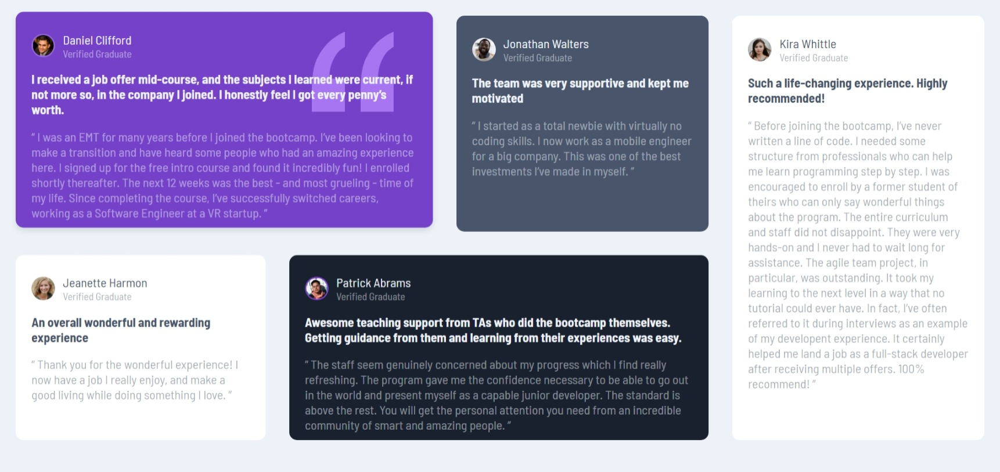

# Frontend Mentor - Testimonials grid section

This is a solution to the [Testimonials grid section challenge on Frontend Mentor](https://www.frontendmentor.io/challenges/testimonials-grid-section-Nnw6J7Un7) Coded By [Fe](feyselteshome05@gmail.com).

## Table of contents
- [Overview](#overview)
  - [The challenge](#the-challenge)
  - [Screenshot](#screenshot)
  - [Links](#links)
- [My process](#my-process)
  - [Built with](#built-with)
  - [What I learned](#what-i-learned)
- [Author](#author)

## Overview

### The challenge

Users should be able to:

- View the optimal layout for the site depending on their device's screen size

### Screenshot

#### Desktop Design

#### Mobile Design

I decided not to attach the mobile screenshot here since it is pretty much long so if you need to see it you can navigate to the [images directory](images/mobile-design.png) and it should be there.

### Links

- Solution URL: [Github Repo](https://testimonials-grid-section-main-phi-nine.vercel.app/)
- Live Site URL: [Vercel](https://testimonials-grid-section-main-phi-nine.vercel.app/)

## My process

### Built with

- Semantic HTML5 markup
- CSS custom properties
- Grid

### What I learned

I learned a lot about CSS Grid, so expect me to use it for a while from now on

## Author

- Frontend Mentor - [@Code-Me-Well](https://www.frontendmentor.io/profile/Code-Me-Well)